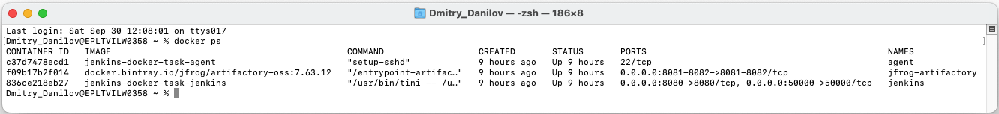
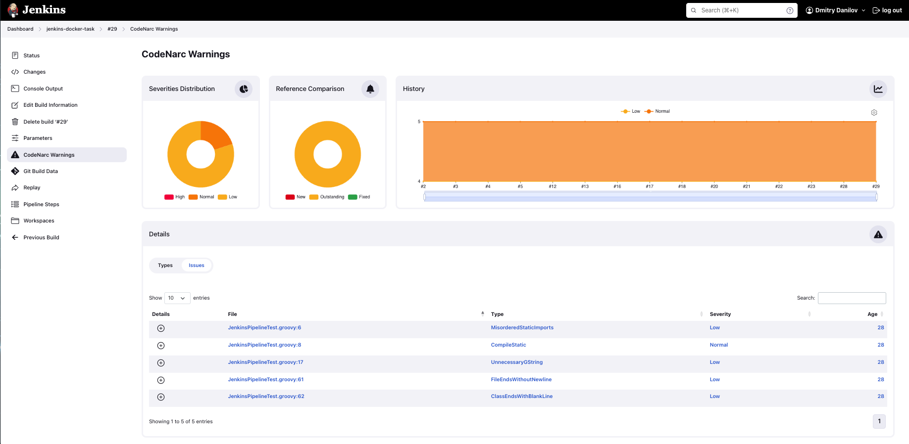
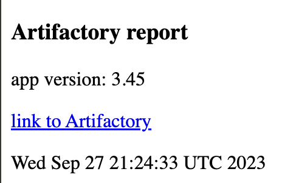
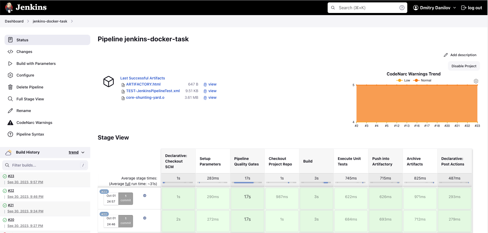
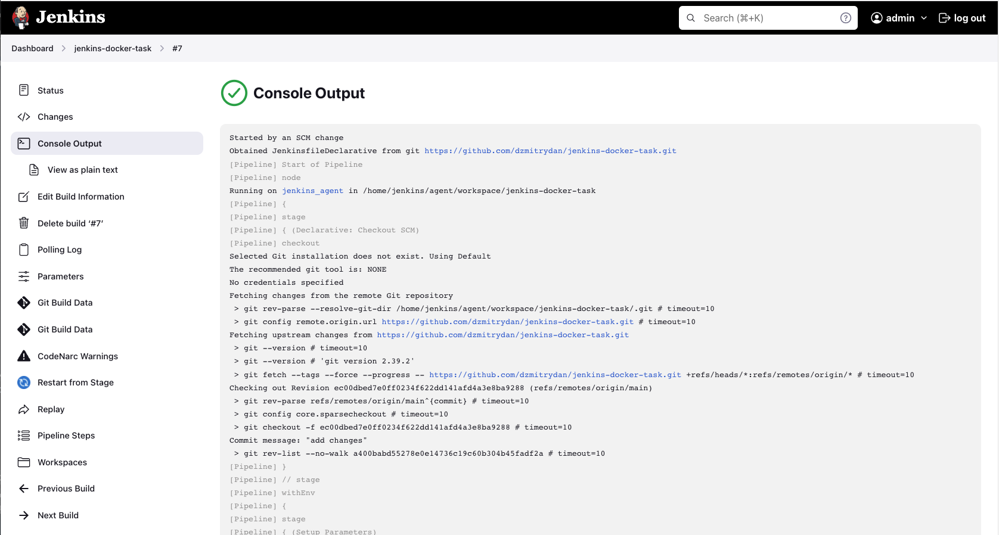
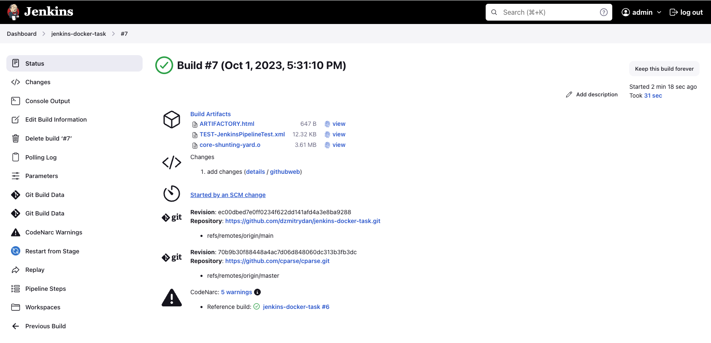
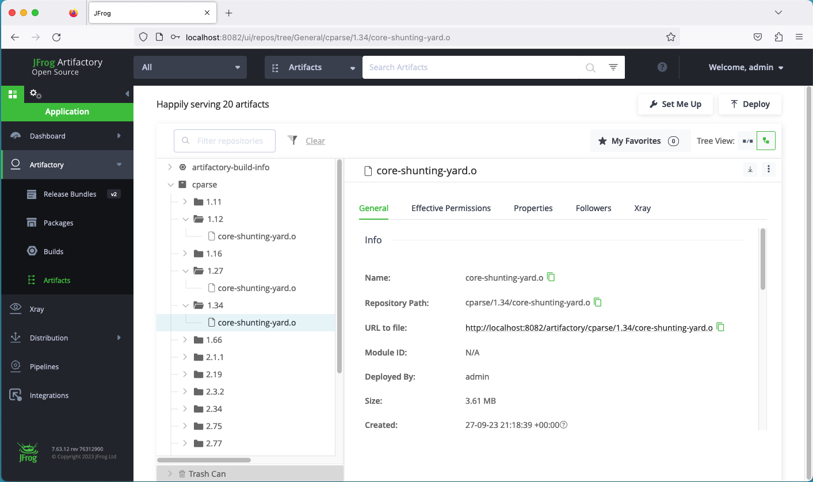
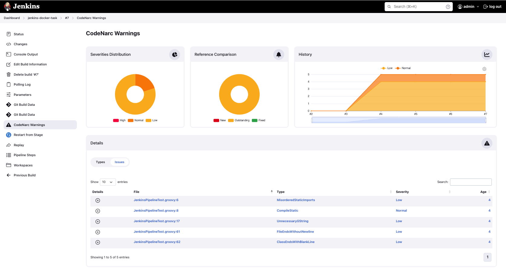

# Jenkins-Docker Task

## Description
### Composition of the project
1. Docker with Docker Compose
2. Jenkins
   - Jenkins Master
   - Jenkins Agent
   - Jenkins Pipeline
3. Project `jenkins-docker-task` (working project)
   - Build tool: [Gradle](https://gradle.org)
   - JenkinsPipelineUnit tests: [Groovy](https://groovy-lang.org) and [JUnit](https://junit.org/junit4)
   - Static code analyzer: [CodeNarc](https://codenarc.org)
   - Jenkinsfile (JenkinsfileScripted, JenkinsfileDeclarative)
   - Docker-compose files
4. C++ project for pipeline: [cparse](https://github.com/cparse/cparse)
5. JFrog Artifactory

#### Precondition
- Docker with components is installed

### 1. Install and Run Jenkins With Docker Compose
#### 1.1 Install by Docker Compose Tools and Tools Components
Install Tools
- Jenkins Master with tools fo C++, Jenkins Plugins and create pipeline
- Jenkins Agent with tools fo C++
- Artifactory

Get pipeline config.xml :`http://localhost:8080/job/jenkins-docker-task/config.xml`

Jenkins plugins
- Suggested Jenkins plugins
- Artifactory plugin
- Warnings Next Generation plugin
- Matrix Authorization Strategy plugin

Tools for building and installing software packages (C++ project)
- autoconf
- make
- build-essential
- libtool
- cmake

Pipeline Settings (config.xml)
- The project is parameterized. The parameter `VERSION` is passed for the directory in the Artifactory.
- Definition: `Pipeline script from SCM`
- SCM: `Git`
- Repository URL: `https://github.com/dzmitrydan/jenkins-docker-task.git`
- Branch Specified: `*/main`
- Script Path: `JenkinsfileScripted`
- Build Triggers: `Poll SCM`; Schedule: `* * * * *`

Run Docker Compose:
```
docker-compose -f jenkins-docker-compose.yml up
```
Stop Docker Compose:
```
docker-compose -f docker-compose.yml down
```
Open bash shell of docker container:
```
docker exec -it jenkins bash
```



#### 1.2 Generate SSH keys (public, private)
```
ssh-keygen -t rsa -f jenkins_agent
```

#### 1.3 In the Jenkins settings (Credentials > Global credentials > Add Credentials): add private SSH key
- Kind: `SSH Username with private key`
- ID: `jenkins_agent`
- Username: `jenkins`
- Select `Enter directly`
- Enter private SSH key

#### 1.4 Node settings:
- Node name: `jenkins_agent`
- Remote Root Directory: `/home/jenkins/agent`
- Host: `agent`
- Launch method: `Launch agents via SSH`
- Credentials: select created
- Host Key Verification Strategy: `Non verifying Verification Strategy`
  


### 2. Artifactory
Jenkins settings for Artifactory
- System > JFrog
    - JFrog Platform Instances
        - Instance ID: `artifactory`
        - JFrog Platform URL: `http://jfrog-artifactory:8082`
        - Username: username for Artifactory
        - Password: password for Artifactory

### 3. Jenkins Pipeline
Jenkins dashboard
- This chart **CodeNarc Warnings Trend** shows the result CodeNarc check
- Archived Artifacts

Data about the version of the binary file, the time and the link to the artifact itself in the Artifactory are displayed in the file`ARTIFACTORY.html ` which on the Jenkins dashboard.

ARTIFACTORY.xml:
[](readme-assets/artifactory-report.png)

Scripted Pipeline


Declarative Pipeline


### 4. Jenkins Pipeline Run
- Trigger a Jenkins build on Git commit (Build Triggers: `Poll SCM`)
- Manually





### 5. Quality Gates (for project `jenkins-docker-task`)
- [CodeNarc](https://codenarc.org)
- Warnings Next Generation Plugin
- Tests for Groovy pipeline: [JenkinsPipelineUnit](https://github.com/jenkinsci/JenkinsPipelineUnit)



Run pipeline tests:
```
./gradlew clean test
```
Run CodeNarc check:
```
./gradlew clean check
```
`./gradlew clean check` runs pipeline tests first and then does CodeNarc check.
