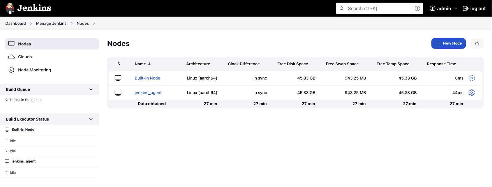

# Jenkins-Docker Task

## Description
### Composition of the project
1. Docker with Docker Compose
2. Jenkins
   - Jenkins Master
   - Jenkins Agent
   - Jenkins Pipeline
3. Project `jenkins-docker-task` (working project)
   - Build tool: [Gradle](https://gradle.org)
   - JenkinsPipelineUnit tests: [Groovy](https://groovy-lang.org) and [JUnit](https://junit.org/junit4)
   - Static code analyzer: [CodeNarc](https://codenarc.org)
   - Jenkinsfile
   - Docker-compose files
4. Project for pipeline [cparse](https://github.com/cparse/cparse)
5. Artifactory

#### Precondition
- Docker with components is installed

### 1. Install and Run Jenkins With Docker Compose
#### 1.1 Install Jenkins master, Jenkins Agent and Artifactory by Docker Compose
Run Docker Compose:
```
docker-compose -f jenkins-docker-compose.yml up -d
```
Stop Docker Compose:
```
docker-compose -f docker-compose.yml down
```
Open bash shell of docker container:
```
docker exec -it jenkins bash
```
#### 1.2 Login and install suggested Jenkins plugins
#### 1.3 Install additional Jenkins plugins
- Artifactory plugin
- Warnings Next Generation plugin

#### 1.4 Generate SSH keys (public, private)
```
ssh-keygen -t rsa -f jenkins_agent
```

#### 1.5 In the Jenkins settings (Credentials > Global credentials > Add Credentials) add private SSH keys
- SSH `Username with private key`
- ID: `jenkins_agent`
- Username: `jenkins`
- Select `Enter directly`
- Enter private SSH key

#### 1.6 Node settings:
- Node name: `jenkins_agent`
- Remote Root Directory: `/home/jenkins/agent`
- Host: `agent`
- Launch method: `Launch agents via SSH`
- Credentials: select created
- Host Key Verification Strategy: `Non verifying Verification Strategy`
- Advanced
  - Java Path: `/opt/java/openjdk/bin/java`; 
  - Connection Timeout Seconds: `60`
  - Max Number of Retries: `10`
  - Seconds To Wait Between Retries: `15`
  - `Use TCP_NODELAY flag on the SSH connection`: check
  


### 2. Artifactory
Jenkins settings for Artifactory
- System > JFrog
    - JFrog Platform Instances
        - Instance ID: `artifactory`
        - JFrog Platform URL: `http://jfrog-artifactory:8082`
        - Username: username for Artifactory
        - Password: password for Artifactory

### 3. Jenkins Pipeline Settings
- Create pipeline
- The project is parameterized. The parameter `VERSION` is passed for the directory in the Artifactory.
- Definition: `Pipeline script from SCM`
- SCM: `Git`
- Repository URL: project `jenkins-docker-task` url
- Branch Specified: `*/main`

The `VERSION` parameter with the artifact uploaded to the Artifactory is put in the `ARTIFACTORY.txt` in the Archive Artifacts.

ARTIFACTORY.txt:
```
app version 2.19
https://blesstask.jfrog.io/ui/repos/tree/General/aircompany/none
Wed Sep 27 21:24:33 UTC 2023
```

Jenkins dashboard
- This chart **Test Result Trend** shows the result of passing Unit tests
- This chart **CodeNarc Warnings Trend** shows the result CodeNarc check


### 4. Jenkins Pipeline Run
Trigger a Jenkins build on Git commit
- Configuring Jenkins (Manage Jenkins > Configure > System Advanced > Check 'Specify another hook url' > Copy this URL)
- Configuring GitHub Repository (add Webhook in the repository Settings)
- Configuring Jenkins Pipeline (Project configuration > Build Triggers > Github hook trigger for GITScm Polling)


### 5. Quality Gates (for project `jenkins-docker-task`)
- [CodeNarc](https://codenarc.org)
- Warnings Next Generation Plugin
- Tests for Groovy pipeline: [JenkinsPipelineUnit](https://github.com/jenkinsci/JenkinsPipelineUnit)


Run pipeline tests:
```
./gradlew test
```
Run CodeNarc check:
```
./gradlew check
```
